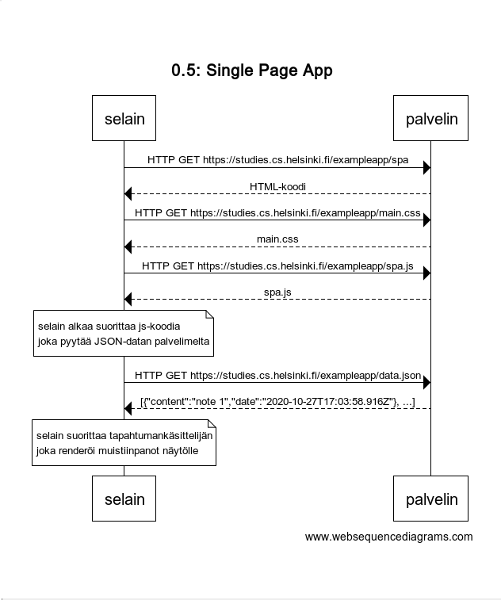

# 0.4: uusi muistiinpano

```
title 0.4: uusi muistiinpano

selain->palvelin: HTTP POST https://studies.cs.helsinki.fi/exampleapp/new_note
palvelin-->selain: Status Code: 302; Location: /exampleapp/notes

selain->palvelin: HTTP GET https://studies.cs.helsinki.fi/exampleapp/notes
palvelin-->selain: HTML-koodi

selain->palvelin: HTTP GET https://studies.cs.helsinki.fi/exampleapp/main.css
palvelin-->selain: main.css

selain->palvelin: HTTP GET https://studies.cs.helsinki.fi/exampleapp/main.js
palvelin-->selain: main.js

note over selain:
selain alkaa suorittaa js-koodia
joka pyytää JSON-datan palvelimelta
end note

selain->palvelin: HTTP GET https://studies.cs.helsinki.fi/exampleapp/data.json
palvelin-->selain: [{"content":"My test note","date":"2020-10-27T16:48:07.753Z"}]

note over selain:
selain suorittaa tapahtumankäsittelijän
joka renderöi muistiinpanot näytölle
end note
```


# 0.5: Single Page App

```
title 0.5: Single Page App

selain->palvelin: HTTP GET https://studies.cs.helsinki.fi/exampleapp/spa
palvelin-->selain: HTML-koodi

selain->palvelin: HTTP GET https://studies.cs.helsinki.fi/exampleapp/main.css
palvelin-->selain: main.css

selain->palvelin: HTTP GET https://studies.cs.helsinki.fi/exampleapp/spa.js
palvelin-->selain: spa.js

note over selain:
selain alkaa suorittaa js-koodia
joka pyytää JSON-datan palvelimelta
end note

selain->palvelin: HTTP GET https://studies.cs.helsinki.fi/exampleapp/data.json
palvelin-->selain: [{"content":"note 1","date":"2020-10-27T17:03:58.916Z"}, ...]

note over selain:
selain suorittaa tapahtumankäsittelijän
joka renderöi muistiinpanot näytölle
end note
```



  
# 0.6: Uusi muistiinpano  

```
title 0.6: Uusi muistiinpano

note over selain:
selain suorittaa tapahtumankäsittelijän form.onSubmit,
joka renderöi muistiinpanot näytölle ja lähettää
POST requestin palvelimelle
end note

selain->palvelin: HTTP POST https://studies.cs.helsinki.fi/exampleapp/new_note_spa
palvelin-->selain: {"message":"note created"}
```

