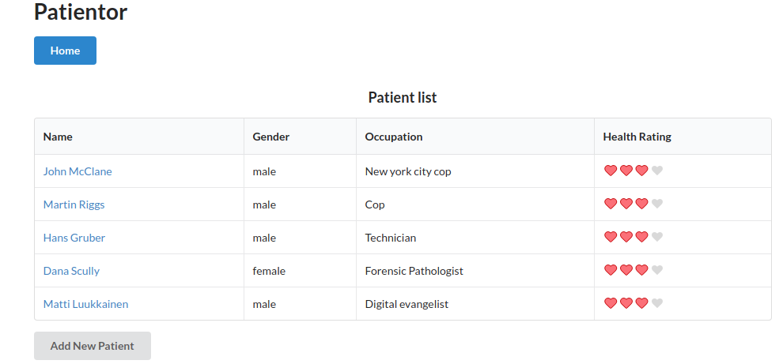

# Directory structure of this return package

```
.
├── REAME.md
├── my-app
├── patientor-backend
├── patientor-frontend
└── web-backend
```

## The mapping between exercises and directories

```
.
└── web-backend
==> Exercises: 9.1.-9.7.

└── my-app
==> Excercises: 9.14.-9.15.

├── patientor-backend
├── patientor-frontend
==> Exercises: 9.8.-9.13. and  9.16.-9.27.
```

## About my-app

After running the command ```npx create-react-app my-app --template typescript``` the following error was received:
```
$ yarn start
yarn run v1.22.5
$ react-scripts start
my-app/node_modules/react-scripts/scripts/utils/verifyTypeScriptSetup.js:239
      appTsConfig.compilerOptions[option] = value;
                                          ^

TypeError: Cannot assign to read only property 'jsx' of object '#<Object>'
...
```

Seems that there is and open issue about this (last accessed 22.11.2020):
[https://github.com/facebook/create-react-app/issues/9960](https://github.com/facebook/create-react-app/issues/9960)

The same thread also highlights a [workaround](https://github.com/facebook/create-react-app/issues/9960#issuecomment-730722889) that I utilized for ```my-app```.

Workaround:
```
package.json:
- "typescript": "^4.0.3"
+ "typescript": "4.0.2"

tsconfig.json
-  "jsx": "react-jsx"
+ "jsx": "react"
```

## Some screenshots of the App 

The below images exhibit the functionality of the backend and front-end that was build during exercises 9.8.-9.13. and 9.16.-9.27.  
  

## Patient list 

  

## Single patient view

  

## Single patient view: Adding new healthcheck entry
 
  

## Sinle patient view: Adding a new hospital entry
 
  
  
## Single patient view: Adding a new occupational healtcare entry
 
  

## Single patient view: View after entry additions

  

## Patient list: Adding a new patient
 
  

## Single patient view: New patient with new entries

  

## Single patient view: Example of how an error message is shown
 
  

## TODO

The implementation of the above shown forms in the front-end (```patientor-frontend/AddPatientEntryModal/Forms```) could maybe be refactored because currently the three entry forms duplicate the same code for fields Date, Specialist, Description and Diagnoses.

However, for these exercises I decided that the current implementation suffices.
